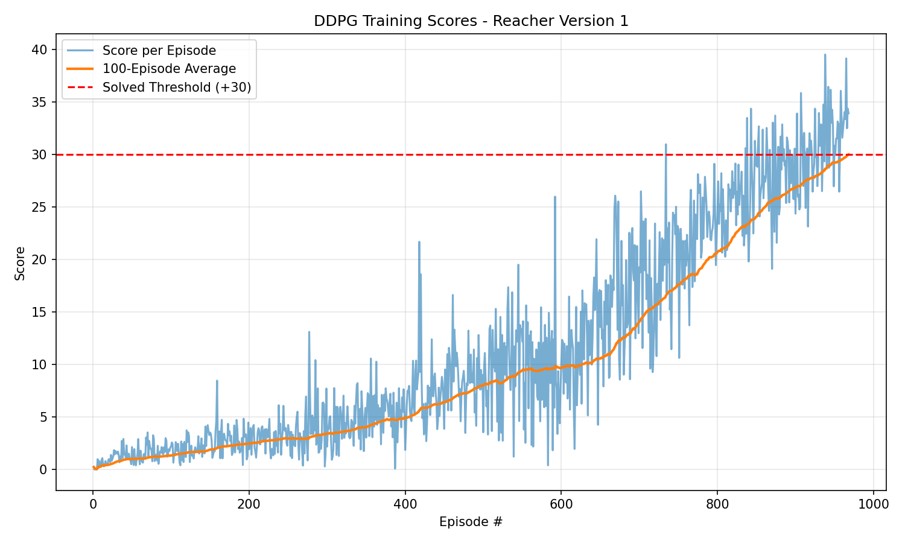
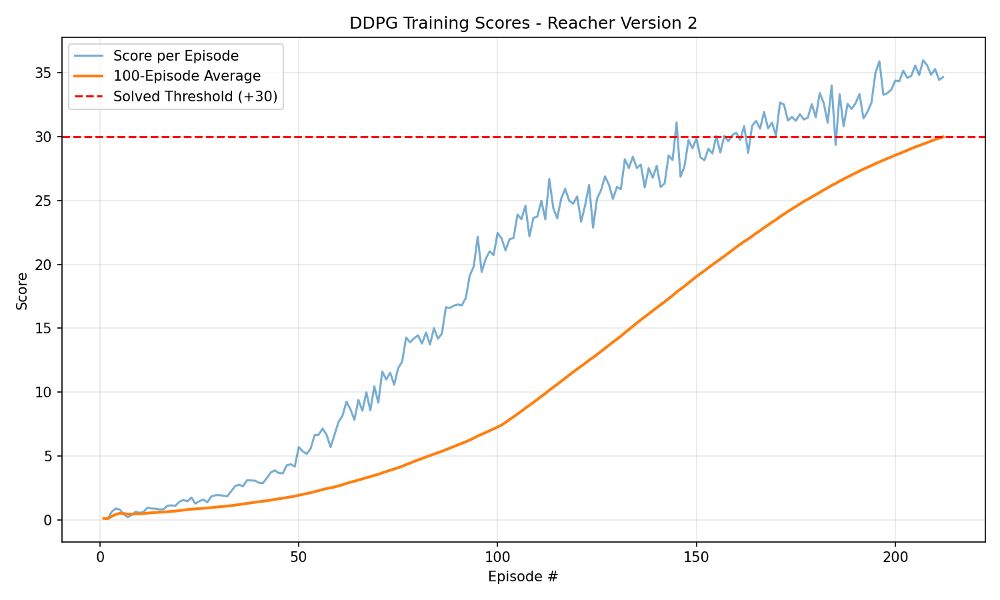

# Project 2: Continuous Control — Report

## Learning Algorithm

This project uses **DDPG (Deep Deterministic Policy Gradient)**, an actor-critic algorithm designed for continuous action spaces. DDPG combines ideas from DPG (Deterministic Policy Gradient) and DQN (Deep Q-Network) to learn a deterministic policy in high-dimensional, continuous action spaces.

### Key Components

**Actor-Critic Architecture**: The agent maintains four neural networks:
- **Actor (local)**: Maps states to actions — the policy network
- **Actor (target)**: Stabilized copy of the actor for computing target values
- **Critic (local)**: Maps (state, action) pairs to Q-values — the value network
- **Critic (target)**: Stabilized copy of the critic for computing target Q-values

**Experience Replay**: Experiences (state, action, reward, next_state, done) are stored in a large replay buffer (1M capacity) and sampled randomly in mini-batches. This breaks temporal correlations and improves sample efficiency.

**Soft Target Updates**: Rather than directly copying weights, target networks are updated slowly using soft updates: $\theta_{target} = \tau \cdot \theta_{local} + (1 - \tau) \cdot \theta_{target}$ with $\tau = 0.001$.

**Ornstein-Uhlenbeck Noise**: Temporally correlated noise is added to the actor's output for exploration. The OU process generates noise that is correlated in time, which is beneficial for physical control tasks with inertia. Parameters: $\theta = 0.15$, $\sigma = 0.2$. The noise is scaled by a decaying factor that starts at 1.0 and is multiplied by `noise_decay` each episode (with a minimum of 0.01), gradually shifting the agent from exploration to exploitation.

**Batch Normalization**: Applied after the first fully connected layer in both actor and critic networks. This normalizes the inputs to each layer, which helps with training stability and allows the network to handle different state dimensions with varying scales.

**Gradient Clipping**: The critic's gradients are clipped to a maximum norm of 1 during training. This prevents large gradient updates that could destabilize learning.

**Delayed Learning**: Instead of learning at every timestep, the agent accumulates experiences and only performs learning updates every 20 steps, with 10 learning passes per update cycle. This allows more diverse experiences to accumulate before updating, improving stability for the multi-agent version.

### Hyperparameters

**Common hyperparameters** (shared across both versions):

| Hyperparameter | Value | Description |
|---------------|-------|-------------|
| BUFFER_SIZE | 1,000,000 | Replay buffer size |
| BATCH_SIZE | 128 | Mini-batch size |
| GAMMA | 0.99 | Discount factor |
| TAU | 0.001 | Soft update interpolation |
| LR_CRITIC | 3e-4 | Critic learning rate |
| WEIGHT_DECAY | 0 | L2 weight decay (critic optimizer) |
| OU θ (theta) | 0.15 | OU noise mean reversion rate |
| OU σ (sigma) | 0.2 | OU noise volatility |

**Version-specific hyperparameters**:

| Hyperparameter | V1 (1 agent) | V2 (20 agents) | Description |
|---------------|-------------|----------------|-------------|
| LR_ACTOR | 2e-4 | 1e-4 | Actor learning rate |
| UPDATE_EVERY | 1 | 20 | Steps between learning updates |
| NUM_UPDATES | 1 | 10 | Learning passes per update |
| noise_decay | 0.9995 | 0.999 | OU noise scale decay per episode (min 0.01) |

### Model Architecture

**Actor Network**:
```
Input (state_size=33)
  → Linear(33, 400) → BatchNorm1d(400) → ReLU
  → Linear(400, 300) → ReLU
  → Linear(300, 4) → Tanh
Output (action_size=4, range [-1, 1])
```

**Critic Network**:
```
Input (state_size=33)
  → Linear(33, 400) → BatchNorm1d(400) → ReLU
  → Concatenate with action (400 + 4 = 404)
  → Linear(404, 300) → ReLU
  → Linear(300, 1)
Output (Q-value)
```

Weight initialization:
- Hidden layers: Uniform distribution $[-\frac{1}{\sqrt{fan\_in}}, \frac{1}{\sqrt{fan\_in}}]$
- Output layers: Uniform distribution $[-3 \times 10^{-3}, 3 \times 10^{-3}]$

## Plot of Rewards

### Version 1 (Single Agent)



*The plot shows the score per episode and the 100-episode moving average. The environment is considered solved when the moving average reaches +30.*

### Version 2 (20 Agents)



*The plot shows the average score across all 20 agents per episode, with the 100-episode moving average. Version 2 typically solves faster due to the parallel experience collection from 20 agents.*

**Note**: Version 1 solved the environment in 968 episodes (first 100-episode moving average ≥ +30). Version 2 solved it in 212 episodes.

## Ideas for Future Work

1. **Proximal Policy Optimization (PPO)**: PPO is an on-policy algorithm that could be more stable for this environment. It uses a clipped surrogate objective to prevent too-large policy updates, which can be particularly effective with the 20-agent version.

2. **Distributed Distributional DDPG (D4PG)**: An extension of DDPG that uses distributed training, n-step returns, and a distributional critic. D4PG has shown state-of-the-art performance on continuous control tasks and would be a natural progression from DDPG.

3. **Prioritized Experience Replay**: Instead of sampling uniformly from the replay buffer, prioritize experiences with higher TD error. This can significantly improve sample efficiency by focusing learning on the most informative experiences.

4. **Parameter Space Noise**: Replace action-space noise (OU noise) with noise applied directly to the network parameters. This can provide more consistent exploration behavior and has been shown to improve performance in some continuous control tasks.

5. **Asynchronous Advantage Actor-Critic (A3C)**: Use asynchronous parallel agents that each maintain their own copy of the environment and model. The diversity from different exploration trajectories can improve learning stability.

6. **Hyperparameter Tuning**: Systematic search over key hyperparameters (learning rates, batch size, network architecture, noise parameters, update frequency) using techniques like Bayesian optimization or population-based training could yield further improvements.

7. **Twin Delayed DDPG (TD3)**: Addresses overestimation bias in DDPG by using twin critics, delayed policy updates, and target policy smoothing. These modifications often lead to more stable and higher-performing policies.