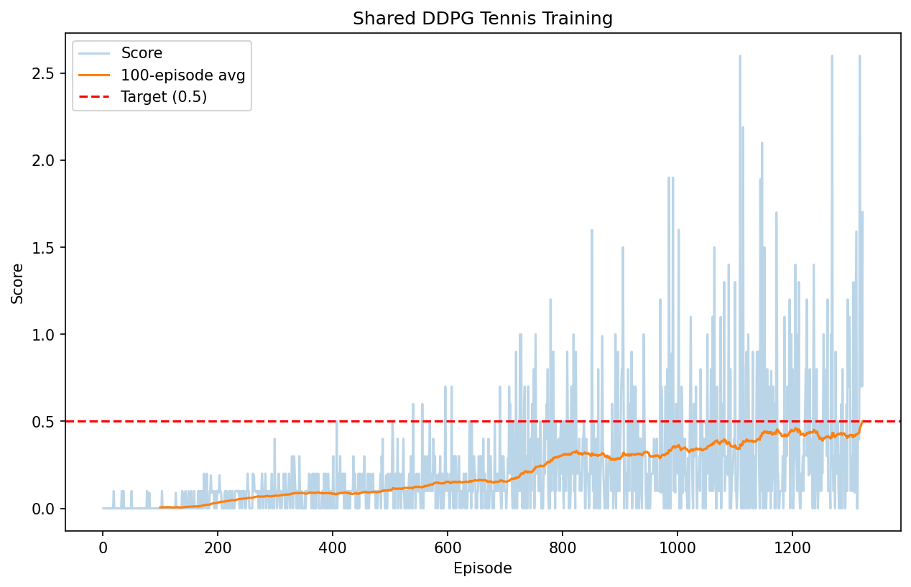

[//]: # (Image References)

[image1]: https://user-images.githubusercontent.com/10624937/42135623-e770e354-7d12-11e8-998d-29fc74429ca2.gif "Trained Agent"
[image2]: https://user-images.githubusercontent.com/10624937/42135622-e55fb586-7d12-11e8-8a54-3c31da15a90a.gif "Soccer"


# Project 3: Collaboration and Competition

![Trained Agent][image1]

## Environment Description

This project uses the **Tennis** Unity environment, where two agents control rackets to bounce a ball over a net.

- **State Space**: 8 variables per agent corresponding to the position and velocity of the ball and racket. The environment stacks 3 consecutive observations, resulting in a state vector of 24 values per agent. Each agent receives its own local observation.
- **Action Space**: 2 continuous actions per agent (movement toward/away from the net, and jumping), each value between -1 and 1.
- **Reward**: +0.1 if an agent hits the ball over the net; -0.01 if the ball hits the ground or goes out of bounds.

### Scoring and Solving Criteria

Each episode produces **two scores** — one per agent — representing the cumulative (undiscounted) reward that agent received. The **episode score** is the **maximum** of these two agent scores. The environment is considered **solved** when the average episode score over 100 consecutive episodes reaches **+0.5**.

## Algorithm

This project uses **Shared DDPG (Deep Deterministic Policy Gradient)** to train both agents.

### Shared DDPG — `train_shared.py`

Both agents share the **same** actor and critic networks (identical weights). This exploits the symmetry of Tennis — both agents have the same observation/action space and task structure. Each agent's experience is stored in the same replay buffer, effectively doubling training data per update.
- **Actor**: agent observation (24) → actions (2), uses LayerNorm
- **Critic**: agent observation (24) + agent action (2) → Q-value, uses LayerNorm

See [Report.md](Report.md) for a detailed description of the algorithm, architecture, hyperparameters, and results.

## Quick Start

```bash
# 1. Install dependencies (from the course python/ directory)
cd ../python
pip install .

# 2. Download the Tennis environment for your OS (see links below)
#    and place/unzip it in the p3_collab-compet/ folder

# 3. Train with Shared DDPG (solves in ~1322 episodes)
cd ../p3_collab-compet
python train_shared.py
```

## Project Structure

```
p3_collab-compet/
├── ddpg_agent.py                   # Shared DDPG agent (LayerNorm), OUNoise, ReplayBuffer
├── train_shared.py                 # Training script (command-line)
├── Tennis.ipynb                    # Jupyter notebook for interactive training
├── Soccer.ipynb                    # (Optional) Soccer environment notebook
├── Report.md                       # Detailed project report
├── README.md                       # This file
├── Tennis.app/                     # Unity Tennis environment (macOS)
├── checkpoint_shared_actor.pth     # Trained actor weights
├── checkpoint_shared_critic.pth    # Trained critic weights
├── scores_shared.npy               # Training scores
└── scores_shared_plot.png          # Training plot
```

## Getting Started

### 1. Install Dependencies

- Python 3.6+
- PyTorch
- NumPy
- Matplotlib
- Unity ML-Agents (`unityagents`)

Install the Unity ML-Agents package from the course repository:

```bash
cd ../python
pip install .
```

### 2. Download the Unity Environment

Download the Tennis environment matching your operating system and place/unzip it in the `p3_collab-compet/` folder:

| Platform | Download Link |
|----------|--------------|
| Linux | [Tennis_Linux.zip](https://s3-us-west-1.amazonaws.com/udacity-drlnd/P3/Tennis/Tennis_Linux.zip) |
| macOS | [Tennis.app.zip](https://s3-us-west-1.amazonaws.com/udacity-drlnd/P3/Tennis/Tennis.app.zip) |
| Windows 32-bit | [Tennis_Windows_x86.zip](https://s3-us-west-1.amazonaws.com/udacity-drlnd/P3/Tennis/Tennis_Windows_x86.zip) |
| Windows 64-bit | [Tennis_Windows_x86_64.zip](https://s3-us-west-1.amazonaws.com/udacity-drlnd/P3/Tennis/Tennis_Windows_x86_64.zip) |
| Linux (headless/AWS) | [Tennis_Linux_NoVis.zip](https://s3-us-west-1.amazonaws.com/udacity-drlnd/P3/Tennis/Tennis_Linux_NoVis.zip) |

> **Note**: After downloading, update the `file_name` path in `train_shared.py` if your environment directory/file differs from the default. The script defaults to `Tennis.app` — change this to match your OS (e.g., `Tennis_Linux/Tennis` on Linux, `Tennis_Windows_x86_64/Tennis.exe` on Windows).

### 3. Train

```bash
python train_shared.py --n_episodes 5000 --max_t 1000
```

This approach solved the environment in **1322 episodes** during testing.

Alternatively, you can train interactively via Jupyter Notebook:

```bash
jupyter notebook Tennis.ipynb
```

## Output Files

After training completes, the following files are generated:

- `checkpoint_shared_actor.pth` — Trained actor model weights
- `checkpoint_shared_critic.pth` — Trained critic model weights
- `scores_shared.npy` — Raw score data (one score per episode)
- `scores_shared_plot.png` — Training reward curve

## Results

The Shared DDPG approach solved the environment in **1322 episodes** (100-episode average score ≥ 0.5).



### (Optional) Challenge: Soccer Environment

After you have successfully completed the project, you might like to solve the more difficult **Soccer** environment.

![Soccer][image2]

You can read more about this environment in the ML-Agents GitHub [here](https://github.com/Unity-Technologies/ml-agents/blob/master/docs/Learning-Environment-Examples.md#soccer-twos). To solve this harder task, you'll need to download a new Unity environment. (**Note**: Udacity students should not submit a project with this new environment.)

| Platform | Download Link |
|----------|--------------|
| Linux | [Soccer_Linux.zip](https://s3-us-west-1.amazonaws.com/udacity-drlnd/P3/Soccer/Soccer_Linux.zip) |
| macOS | [Soccer.app.zip](https://s3-us-west-1.amazonaws.com/udacity-drlnd/P3/Soccer/Soccer.app.zip) |
| Windows 32-bit | [Soccer_Windows_x86.zip](https://s3-us-west-1.amazonaws.com/udacity-drlnd/P3/Soccer/Soccer_Windows_x86.zip) |
| Windows 64-bit | [Soccer_Windows_x86_64.zip](https://s3-us-west-1.amazonaws.com/udacity-drlnd/P3/Soccer/Soccer_Windows_x86_64.zip) |

Place the file in the `p3_collab-compet/` folder and unzip. Then open `Soccer.ipynb` and follow the instructions.
